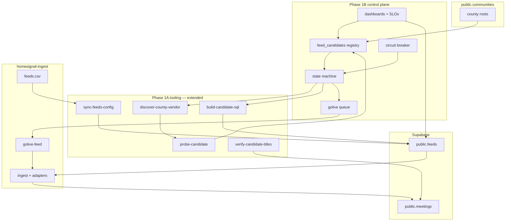
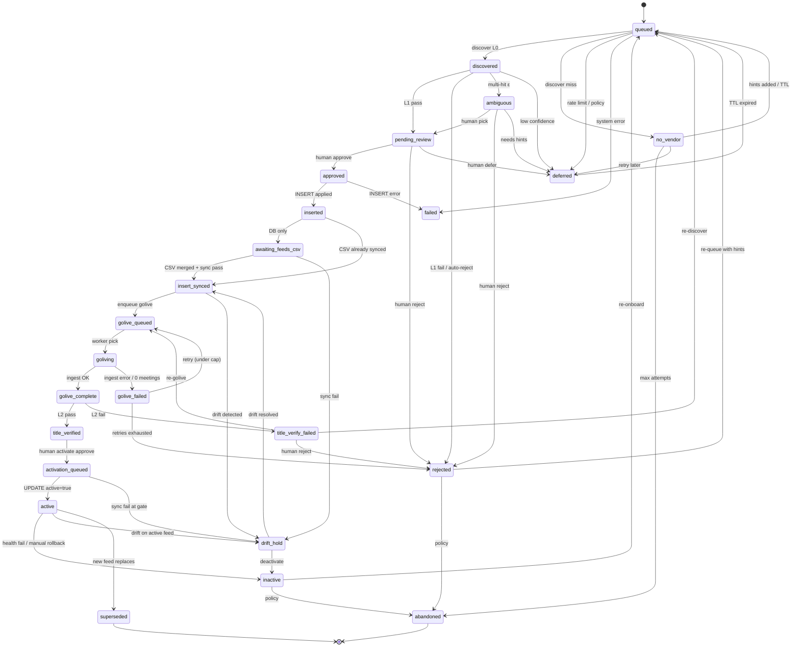

# Government Feed Onboarding — Phase 1B Engineering Design (v2)

**Status:** Final approval candidate (documentation only — no implementation)  
**Version:** 2.0  
**Date:** 2026-07-19  
**Prerequisite:** Phase 1A complete (`main` @ `a257bae`)  
**Scope:** County **Meetings** feeds via Granicus, Legistar, and CivicClerk  
**Phase 1B ceiling:** **25 counties** (Pilot C). Scaling beyond 25 is **Phase 1C**.

**Companion docs:**

- Phase 1A operator runbook: `docs/government-feed-onboarding-operator.md`
- Phase 1A workflow summary: `docs/government-feed-onboarding.md`
- Ingest migration map: `docs/gov-feeds-migration-to-ingest.md`
- Vendor / portal registry: `docs/state-notice-portals.md`

---

## Executive summary

Phase 1A proved the manual path for **one county**: discover → probe → human review → inactive INSERT → golive → title verification → separate activation. It is correct but operator-heavy and not batch-safe.

Phase 1B builds a **governed control plane** around that path: a durable candidate registry, a complete state machine, operational SLOs, monitoring dashboards, and a batch circuit breaker. The goal is to onboard up to **25 counties** safely through three pilots — not hundreds.

> **Phase 1C begins after successful completion of Pilot C.**

Phase 1C owns 250+ county scaling (bulk insert, parallel golive, exception-only review, probe caching, and tier-2 auto-approve). That work is explicitly **out of Phase 1B scope**.

---

## 1. Objectives

### 1.1 What Phase 1B accomplishes

| # | Capability | Phase 1A | Phase 1B |
|---|------------|----------|----------|
| 1 | **Candidate registry** | Ephemeral JSON in `results/` | Durable `feed_candidates` store with full state machine |
| 2 | **Batch discovery** | One county per run | Batch discover up to 25 with quarantine-not-stop |
| 3 | **Approval workflow** | Ad hoc human review | Structured approve/reject/defer with audit trail |
| 4 | **Sync gate** | Manual `sync-feeds-config` | Scheduled drift detection; blocks activation |
| 5 | **Golive orchestration** | Manual `golive-feed` dispatch | Durable golive queue (2 parallel max in Phase 1B) |
| 6 | **Feed health** | None post-activation | Daily probe + auto-deactivate after 3 failures |
| 7 | **Operational visibility** | None | Six required dashboards (see §6) |
| 8 | **Batch safety** | None | Circuit breaker with halt / recovery / override |
| 9 | **Quality hardening** | Hostname-scoped L2 | Feed-scoped title verification (design requirement) |

**Out of Phase 1B scope:** city councils, government Notices, new vendor adapters, tier-2 auto-approve, 250+ county waves.

### 1.2 Success criteria

Measurable by **Pilot C exit**:

1. **25 counties attempted** in one batch (one state pilot); ≥ 15 reach `active` (realistic vendor hit rate).
2. **0 activations** without recorded `title_verified_at` (hard invariant).
3. **0 wrong-board findings** in post-activation audit sample (10%, min 3 counties).
4. **0 active-feed drift** lasting > 24 hours during 7-day soak.
5. **Batch completes** with quarantined failures and **does not stop** on per-county errors.
6. **Circuit breaker** tested (injected failure halts batch; recovery documented).
7. **Operator time** < 8 hours total for Pilot C (efficiency vs Phase 1A baseline).

### 1.3 Exit criteria (Phase 1B complete)

Phase 1B is **done** when:

- [ ] Pilots A (1), B (5), and C (25) all exit green
- [ ] `feed_candidates` registry is the pipeline source of truth
- [ ] Full state machine implemented with transition enforcement
- [ ] Six operational dashboards live (SQL views minimum)
- [ ] SLOs in §5 measured for 7 consecutive days post–Pilot C
- [ ] Batch circuit breaker exercised in Pilot B or C
- [ ] L2 title verification scoped to feed-specific URL signature (not hostname alone)
- [ ] `activate-feed` workflow enforces sync + title-verify gates
- [ ] Runbook updated for queue mode (`docs/government-feed-onboarding-operator.md` appendix or successor)

> **Phase 1C begins after successful completion of Pilot C.**

---

## 2. Architecture

### 2.1 System context



**Authority chain (unchanged):**

1. `public.feeds` — runtime truth for ingest (`load_config` is **DB-first**)
2. `homesignal-ingest/feeds.csv` — versioned authoring surface; drift must be zero before activation
3. `public.communities` — county root `community_id` anchor
4. `feed_candidates` — pipeline orchestration; proposals until `inserted`

### 2.2 Candidate registry (`feed_candidates`)

Minimum columns (implementation detail deferred; schema is a Phase 1B deliverable):

| Column | Purpose |
|--------|---------|
| `id` | UUID primary key |
| `feed_id` | Canonical slug (from `communities.slug` + vendor) |
| `community_id` | County root UUID |
| `state` | Machine state (see §2.3) |
| `status_reason` | Human-readable sub-reason |
| `vendor` | `granicus` \| `legistar` \| `civicclerk` |
| `source` | Feed URL |
| `confidence` | Discovery score 0–1 |
| `batch_id` | Pilot / wave identifier |
| `claimed_by` | Operator lock (nullable) |
| `claimed_at` | Lock timestamp |
| `title_verified_at` | Set on L2 pass (required before activation) |
| `activated_at` | Set on `active=true` |
| `blocked_by` | `drift` \| `circuit_breaker` \| `missing_secret` \| null |
| `discovery_artifact_path` | Pointer to JSON artifact |
| `audit_log` | JSON array of transitions |

**Invariants:**

- At most **one** `active=true` county meetings feed per `community_id` in Phase 1B
- `feed_id` derived from `communities.slug` + vendor — **not** free-text `--county` (fixes Phase 1A naming drift)
- `title_verified_at` MUST be non-null before `activation_queued` → `active`

### 2.3 Candidate state machine

#### 2.3.1 States

| State | Description | Terminal? |
|-------|-------------|-----------|
| `queued` | Eligible for discovery; not yet probed | No |
| `discovered` | Vendor hit found; L1 probe not yet run | No |
| `deferred` | Intentionally paused (low confidence, rate limit, seasonal, awaiting hints) | No |
| `ambiguous` | Multiple viable hits; human must pick one | No |
| `no_vendor` | No Granicus/Legistar/CivicClerk hit above floor | No* |
| `pending_review` | L1 passed; awaiting human approve/reject/defer | No |
| `approved` | Human approved; INSERT not yet applied | No |
| `inserted` | Row in `public.feeds` with `active=false` | No |
| `awaiting_feeds_csv` | DB row exists; `feeds.csv` PR not merged | No |
| `insert_synced` | DB and `feeds.csv` agree (`sync` exit 0 for this `feed_id`) | No |
| `golive_queued` | Job in golive queue | No |
| `goliving` | `golive-feed` in flight | No |
| `golive_failed` | Golive exhausted retries | No |
| `title_verify_failed` | L2 ratio below threshold | No |
| `activation_queued` | Approved for activate; `UPDATE active=true` pending | No |
| `active` | `public.feeds.active=true`; ingest scheduled | No |
| `inactive` | Deactivated (health failure or manual rollback) | No |
| `drift_hold` | Active or pre-active feed has CSV/DB mismatch | No |
| `rejected` | Human or auto-reject; will not proceed without re-queue | No |
| `superseded` | Replaced by newer feed (vendor migration) | Yes |
| `abandoned` | Permanently unwirable after N attempts | Yes |
| `failed` | Unrecoverable system error | No** |

\* `no_vendor` may transition to `abandoned` after policy threshold.  
\** `failed` may transition back to `queued` after operator fix.

#### 2.3.2 State diagram



Note: `title_verified` is an implicit checkpoint (set `title_verified_at`) between `golive_complete` and `activation_queued`. It may be implemented as a named state or as a gate on `activation_queued` entry.

#### 2.3.3 Legal transitions

| From | To | Trigger | Actor |
|------|-----|---------|-------|
| `queued` | `discovered` | Discovery hit + artifact written | System |
| `queued` | `no_vendor` | Discovery 0 hits above floor | System |
| `queued` | `deferred` | Rate limit, policy pause | System |
| `queued` | `failed` | Unrecoverable discovery error | System |
| `discovered` | `pending_review` | L1 probe exit 0 | System |
| `discovered` | `rejected` | L1 fail or auto-reject rules (§5.3) | System |
| `discovered` | `ambiguous` | Top-2 confidence within ε=0.10 | System |
| `discovered` | `deferred` | Confidence 0.50–0.69 | System |
| `ambiguous` | `pending_review` | Human selects hit | Operator |
| `ambiguous` | `rejected` | Human reject | Operator |
| `ambiguous` | `deferred` | Awaiting hints | Operator |
| `no_vendor` | `queued` | Hints added / 30-day TTL | Operator / System |
| `no_vendor` | `abandoned` | ≥ 3 discovery passes failed | System |
| `deferred` | `queued` | TTL expired (default 7–30 days) | System |
| `pending_review` | `approved` | Human approve + audit record | Operator |
| `pending_review` | `rejected` | Human reject | Operator |
| `pending_review` | `deferred` | Human defer | Operator |
| `approved` | `inserted` | `insert-gov-feed-candidate` success | CI |
| `approved` | `failed` | INSERT error | CI |
| `inserted` | `awaiting_feeds_csv` | DB row exists; CSV PR open | System |
| `inserted` | `insert_synced` | CSV already in sync | System |
| `awaiting_feeds_csv` | `insert_synced` | CSV merged; per-feed sync pass | System |
| `awaiting_feeds_csv` | `drift_hold` | Sync fail | System |
| `insert_synced` | `golive_queued` | Enqueue golive job | System |
| `insert_synced` | `drift_hold` | Drift detected | System |
| `golive_queued` | `goliving` | Worker claims job | System |
| `goliving` | `title_verified`* | Golive success + L2 pass | System |
| `goliving` | `golive_failed` | Golive error or 0 meetings | System |
| `golive_failed` | `golive_queued` | Retry (max 3) | System |
| `golive_failed` | `rejected` | Retries exhausted | System |
| `title_verified`* | `activation_queued` | Human activate decision | Operator |
| `title_verify_failed` | `golive_queued` | Re-golive approved | Operator |
| `title_verify_failed` | `queued` | Re-discover | Operator |
| `title_verify_failed` | `rejected` | Human reject | Operator |
| `activation_queued` | `active` | `activate-feed` workflow success | CI / Operator |
| `activation_queued` | `drift_hold` | Sync gate fail | System |
| `active` | `inactive` | 3× probe fail or manual rollback | System / Operator |
| `active` | `drift_hold` | Active-feed drift | System |
| `active` | `superseded` | New feed replaces | Operator |
| `inactive` | `queued` | Re-onboard | Operator |
| `inactive` | `abandoned` | Policy | Operator |
| `drift_hold` | `insert_synced` | Drift resolved | Operator |
| `drift_hold` | `inactive` | Deactivate while held | Operator |
| `rejected` | `queued` | Re-queue with new hints | Operator |
| `rejected` | `abandoned` | Policy | Operator |
| `failed` | `queued` | Operator fix + retry | Operator |

\* `title_verified` — gate requiring non-null `title_verified_at`; may be a named state or enforced on `activation_queued` entry.

#### 2.3.4 Illegal transitions (hard reject)

| Transition | Reason |
|------------|--------|
| Any → `active` | Except from `activation_queued` with `title_verified_at` set |
| `queued` → `active` | Skips safety gates |
| `approved` → `active` | Skips insert, golive, L2 |
| `inserted` → `golive_queued` | Skips sync (unless `insert_synced`) |
| `pending_review` → `inserted` | Skips explicit `approved` |
| `no_vendor` → `active` | No feed source |
| `golive_failed` → `active` | Skips L2 |
| `drift_hold` → `active` | Drift unresolved |
| `rejected` → `active` | Must re-enter via `queued` |
| `abandoned` → any (except audit) | Terminal |
| `superseded` → any (except audit) | Terminal |
| `ambiguous` → `inserted` | Skips human pick + approve |
| Any → `active` when circuit breaker `halted` | Batch safety (§7) |

Transition enforcement lives in the registry application layer and CI workflow guards — not honor-system.

### 2.4 Discovery pipeline

**Input:** County root (`id`, `name`, `county`, `state`, `slug`, `level='county'`).

**Process:**

1. Transition `queued` → discovery run (`discover-county-vendor.mjs` or batch wrapper).
2. Resolve hints from hints registry (keyed by `slug`).
3. Probe vendor URLs (max 40 probes/county; Pilot C batch uses 20 if rate-limited).
4. Score hits; write artifact to durable path `discovery/{state}/{slug}.json`.
5. Branch:
   - 0 hits → `no_vendor`
   - Top-2 within ε → `ambiguous`
   - Confidence < 0.50 → `deferred`
   - L1 fail → `rejected`
   - L1 pass → `pending_review`

**Canonical `feed_id`:** `{communities.slug}-{vendor}-meetings` (e.g. `wake-county-nc-granicus-meetings`).

**Batch mode (Pilot C):** quarantine per county on failure; **never stop the batch** (circuit breaker excepted — §7).

### 2.5 Feed verification (three layers)

| Layer | Tool | When | Pass |
|-------|------|------|------|
| **L1 — Vendor probe** | `probe-candidate.mjs` | Pre-insert | Exit 0; parseable content |
| **L2 — Title verification** | `verify-candidate-titles.mjs` (feed-scoped) | Post-golive, pre-activate | ≥ 80% board regex; **scoped to feed URL signature** (`view_id`, Legistar path, CivicClerk sub) — not hostname alone |
| **L3 — Feed health** | Daily probe job | On `active` feeds | Probe pass; or seasonal exemption logged |

**L2 hardening (Phase 1B requirement):** Hostname-only scoping (current Phase 1A behavior) is **insufficient** — shared Granicus subdomains can pass L2 with the wrong board's meetings. Phase 1B must scope by feed-specific URL components before Pilot B.

### 2.6 Human approval

**Gate:** No INSERT without `approved` state + audit record.

**Approval record (required fields):**

| Field | Required |
|-------|----------|
| `feed_id` | yes |
| `community_id` | yes |
| `reviewer` | yes |
| `decision` | `approve` \| `reject` \| `defer` |
| `sample_titles` | yes on approve |
| `reason` | yes on reject/defer |
| `timestamp` | yes |

**Pilot approval rates:**

| Pilot | Human approval | Post-activation audit |
|-------|----------------|----------------------|
| A (1) | 100% at every gate | 100% |
| B (5) | 100% before insert | 20% sample |
| C (25) | 100% before insert | 10% sample (min 3) |

**No tier-2 auto-approve in Phase 1B.** Exception-only review is Phase 1C.

### 2.7 Production activation sequence

```
approved → inserted → [awaiting_feeds_csv →] insert_synced → golive_queued → goliving
  → title_verified (title_verified_at set) → activation_queued → active
```

| Step | Gate |
|------|------|
| INSERT | `active=false`; `ON CONFLICT DO NOTHING` |
| CSV merge | `feeds.csv` row matches INSERT |
| Sync | Per-feed sync pass → `insert_synced` |
| Golive | `golive-feed` `ONLY_FEED=<feed_id>` via queue |
| L2 | `title_verified_at` set; ratio ≥ 0.80 |
| Activate | `activate-feed` workflow; requires sync + L2 |
| CSV `active=true` | Ingest PR; re-sync |

**DB-first note:** Ingest reads `public.feeds` via `load_config`. Golive may run when DB row exists. **Activation is blocked** until `insert_synced` and L2 pass.

### 2.8 Golive queue

Durable `golive_jobs` (table or equivalent):

| Field | Purpose |
|-------|---------|
| `feed_id` | Target feed |
| `status` | `queued` \| `running` \| `complete` \| `failed` \| `dlq` |
| `attempts` | Retry count (max 3) |
| `next_run_at` | Backoff scheduling |
| `batch_id` | Circuit breaker grouping |
| `error` | Last failure message |

**Phase 1B concurrency:** max **2 parallel** golive jobs. Prove ingest capacity before raising (Phase 1C).

### 2.9 Monitoring and rollback

**Daily jobs:**

| Job | Action on failure |
|-----|-------------------|
| Drift sync | Alert; `drift_hold`; block activation |
| Vendor probe (active) | 3 strikes → `inactive` |
| Stuck-state scan | Alert if p95 time-in-state exceeded |
| Meeting freshness | Warn if no meetings in 90 days (seasonal exemption logged) |

**Rollback (per feed):**

1. `UPDATE public.feeds SET active=false WHERE feed_id=…`
2. `feeds.csv` → `active=false`
3. Re-sync
4. Registry → `inactive`
5. Meetings cleanup: ingest-side policy (destructive — founder approval)

---

## 3. Scaling strategy

### 3.1 Phase 1B scope boundary

| Scale | Phase | Notes |
|-------|-------|-------|
| **1 county** | 1B Pilot A | Prove state machine |
| **5 counties** | 1B Pilot B | Prove ops + golive queue |
| **25 counties** | 1B Pilot C | Prove batch + circuit breaker |
| **250 counties** | **1C** | Bulk insert, parallel golive, probe cache |
| **2,500 counties** | **Phase 2** | Job platform, auto-approve, adapter expansion |

Phase 1B does **not** target hundreds of counties. References to 100/250/500-county waves belong in Phase 1C planning.

### 3.2 One county (Pilot A)

- Manual trigger at each step; every transition logged in `feed_candidates`
- 100% human review; 100% post-activation audit
- Rollback drill required
- Duration: 1–2 days

### 3.3 Five counties (Pilot B)

- Semi-automated discovery; 100% human approve before insert
- Golive queue at 2 parallel
- Test operator claim/lock and circuit breaker with injected failure
- 20% post-activation audit
- Duration: ~1 week

### 3.4 Twenty-five counties (Pilot C)

- `discover-batch --state <ST> --limit 25`; quarantine-not-stop
- Single ingest PR for `feeds.csv` + SQL files (≤ 25)
- Golive queue; staggered 2 parallel (~half day)
- 10% post-activation audit (min 3)
- Duration: ~2 weeks (1 week batch + 1 week soak)

### 3.5 Phase 1C preview (not Phase 1B)

After Pilot C exit:

- 250-county waves with exception-only human review
- Bulk INSERT API (not one-workflow-per-file)
- Parallel golive (5–10 workers after capacity proof)
- Probe result cache (7-day TTL)
- Tier-2 auto-approve for confidence ≥ 0.90 (founder sign-off required)

---

## 4. Operational workflow

### 4.1 Daily operator workflow

| Time (UTC) | Task |
|------------|------|
| 06:00 | Review overnight discovery / golive queue results |
| 06:30 | Triage `stuck candidates` dashboard |
| 07:00 | Approve `pending_review` candidates (claim before review) |
| 07:30 | Merge ingest PRs for `approved` rows |
| 08:00 | Monitor golive queue + L2 failures |
| 09:00 | Activate `title_verified` feeds (sync gate) |
| 10:00 | Review drift board + feed health alerts |
| EOD | Clear all CRITICAL alerts; log circuit breaker status |

### 4.2 Weekly maintenance

| Task |
|------|
| Re-queue `deferred` counties past TTL |
| Audit `active` feeds with 0 meetings in 90 days |
| Review `no_vendor` → `abandoned` candidates |
| Refresh hints registry from successful onboardings |
| Reconcile `feed_candidates` vs `public.feeds` |
| Review circuit breaker audit log |

### 4.3 Failure handling

| Failure | State | Response |
|---------|-------|----------|
| Discovery 0 hits | `no_vendor` | Defer or abandon per policy |
| L1 fail | `rejected` | Auto-reject; optional re-queue |
| INSERT refused | `failed` | Fix SQL; never bypass workflow grep |
| Golive 0 meetings | `golive_failed` | Retry → reject |
| L2 fail | `title_verify_failed` | Re-golive or re-discover |
| Drift | `drift_hold` | Block activation; reconcile |
| 3× probe fail | `inactive` | Auto-deactivate; operator MTTR |
| Circuit breaker trip | batch `halted` | §7 recovery |

### 4.4 Duplicate detection

| Type | Action |
|------|--------|
| Same `feed_id` | `ON CONFLICT DO NOTHING`; alert if URL differs |
| Same `community_id` + active meetings feed | Reject second candidate |
| Same `source` URL, different `feed_id` | Reject; merge to canonical |
| CSV missing DB row | `missing_from_db` drift |
| DB row missing CSV row | Informational (Phase 1A); log |

### 4.5 Vendor changes

Update `source` in DB + `feeds.csv` atomically → sync pass → re-golive → L2 → re-activate. Old feed → `superseded`.

### 4.6 Broken feeds

| Severity | Condition | Action |
|----------|-----------|--------|
| WARN | 1 probe failure | Retry next day |
| ALERT | 3 consecutive failures | Auto `inactive`; operator notified |
| CRITICAL | 7 failures or ingest error > 50% | `inactive` + incident |

---

## 5. Quality controls and SLOs

### 5.1 Confidence thresholds

| Score | Action |
|-------|--------|
| ≥ 0.90 | Eligible for Phase 1C tier-2 auto-approve (not Phase 1B) |
| 0.70 – 0.89 | Human review required |
| 0.50 – 0.69 | `deferred` + mandatory hints |
| < 0.50 | Auto-reject or `no_vendor` |

### 5.2 Human review requirements (Phase 1B)

Always required: first county in a state, confidence < 0.90, `ambiguous`, borderline L2 (0.70–0.79), any re-submit after reject.

### 5.3 Automatic rejection rules

Reject without human review if:

- `source_type` invalid for Phase 1B vendors
- Sub-committee URL/title patterns
- 0 titles match board regex on L1 sample
- `community_id` not county root
- Duplicate `feed_id` or active feed for same county
- INSERT SQL contains `active=true` or `ON CONFLICT DO UPDATE`
- `source` host not in vendor allow-list

### 5.4 Drift detection

Daily `sync-feeds-config --live`. Per-feed sync pass required for `insert_synced` and `activation_queued`. Active-feed drift → `drift_hold` within 1 hour.

### 5.5 Operational SLOs

| SLO | Target | Measurement |
|-----|--------|-------------|
| **Activations without title verification** | **0** (hard) | `active` rows where `title_verified_at` IS NULL |
| **Active-feed drift > 24h** | **0** | `drift_hold` or sync mismatch on `active=true` |
| **Wrong-board rate** | **0%** in Pilots A–C | Post-activation audit sample |
| **Golive success rate** | **≥ 90%** | % reaching L2 within 24h of `golive_queued` |
| **Probe MTTR** | **< 48h** operator response | `inactive` → resolved |
| **Stuck `pending_review`** | **< 7 days** p95 | time-in-state |
| **Stuck `golive_failed`** | **< 3 days** p95 | time-in-state |
| **Stuck `awaiting_feeds_csv`** | **< 5 days** p95 | time-in-state |
| **End-to-end activation** | **< 14 days** p95 | `queued` → `active` (Pilot C) |
| **Batch completion** | **100%** | Batch finishes with quarantines; no silent stop |

### 5.6 Alerting

| Alert | Channel | Severity |
|-------|---------|----------|
| SLO: activation without L2 | GitHub Issue | CRITICAL |
| Active drift > 1h | GitHub Issue | HIGH |
| 3× probe failure | GitHub Issue | MEDIUM |
| Circuit breaker trip | GitHub Issue | CRITICAL |
| Stuck state p95 breach | GitHub Issue | MEDIUM |
| Golive DLQ depth > 0 | GitHub Issue | MEDIUM |

---

## 6. Required operational dashboards

Minimum implementation: **Supabase SQL views** + daily CI artifact. Custom UI is Phase 1C.

### 6.1 Operator queue

- Rows by state: `pending_review`, `approved`, `ambiguous`, `title_verify_failed`
- Sortable by age, `batch_id`, `state` (geography)
- `claimed_by` / claim action
- One-click links to discovery artifact, probe output, SQL file

### 6.2 Pipeline funnel

- Counts at each state for active `batch_id` and all-time
- Conversion rates: `queued` → `discovered` → `pending_review` → `active`
- Drop-off reasons (`status_reason` histogram)

### 6.3 Stuck candidates

- Any row where `now() - state_entered_at` exceeds p95 target (§5.5)
- Grouped by state and `blocked_by`
- Age descending

### 6.4 Drift board

- Per-feed sync status from `sync-feeds-config`
- Highlight `active_reconcile` mismatches
- `drift_hold` rows with field-level diff
- Time since first drift detection

### 6.5 Feed health

- Active feeds: last probe result, `meetings_count_30d`, `last_meeting_date`
- Auto-deactivations in last 7 days
- Seasonal exemptions flagged
- Probe failure streak

### 6.6 Golive queue

- Depth: `queued`, `running`, `failed`, `dlq`
- In-flight jobs with `feed_id`, `batch_id`, `attempts`
- Throughput: completions per hour
- Circuit breaker status (`open` \| `closed` \| `half_open`)

---

## 7. Batch circuit breaker

Prevents systemic failures from activating many wrong boards before human detection.

### 7.1 Scope

Applies to batch discovery (Pilot C) and golive batches sharing a `batch_id`.

### 7.2 Halt conditions (any triggers halt)

| # | Condition |
|---|-----------|
| H1 | ≥ **2** `title_verify_failed` in same `batch_id` |
| H2 | ≥ **3** `golive_failed` in same `batch_id` within 1 hour |
| H3 | ≥ **2** post-activation audit failures in same `batch_id` |
| H4 | Same vendor adapter error code on ≥ **3** counties in same batch |
| H5 | Operator manual halt via `circuit_breaker_halt` flag |

On halt:

- Set `batches.circuit_status = halted`
- Block all transitions to `activation_queued` and `active` for that `batch_id`
- Allow discovery/L1 to complete (read-only) but block INSERT for remaining counties in batch
- Page operator (CRITICAL alert)

### 7.3 Recovery procedure

1. Operator diagnoses root cause (adapter bug, wrong hints, vendor outage, L2 scope).
2. Fix applied (code, hints, or config) — documented in audit log.
3. Operator runs **recovery checklist:**
   - [ ] Failed counties moved to `rejected` or `queued` (not left in limbo)
   - [ ] No county in `activation_queued` for halted batch
   - [ ] Injected test county passes L1 + L2 in isolation
4. Operator sets `circuit_status = half_open`.
5. **One** county allowed through full path to `active` as canary.
6. If canary passes 24h health → `circuit_status = closed`; batch resumes.
7. If canary fails → return to `halted`; escalate.

### 7.4 Manual override

Founder-only override to resume batch without canary:

- Requires `override_reason` (≥ 50 chars) in audit log
- Requires explicit acknowledgement of wrong-board risk
- Logged with `reviewer`, `timestamp`, `batch_id`
- **Not available** for SLO hard invariants (activation without L2)

### 7.5 Audit logging

Every circuit breaker event appends to `circuit_breaker_audit`:

| Field | Value |
|-------|-------|
| `batch_id` | Batch identifier |
| `event` | `halt` \| `half_open` \| `closed` \| `override` |
| `trigger` | H1–H5 code |
| `affected_feed_ids` | Array |
| `reviewer` | Operator / founder |
| `reason` | Text |
| `timestamp` | ISO 8601 |

Retention: indefinite (compliance / postmortem).

---

## 8. Metrics

| Metric | Formula / source |
|--------|------------------|
| Discovery success rate | L1 pass / attempted |
| Feed health score | probe pass ∧ (meetings_30d > 0 ∨ seasonal_exempt) |
| Active meeting feeds | `count(*) WHERE active=true AND target_table='meetings'` |
| Failed probes (24h) | probe failures / attempts |
| Coverage by state | active county feeds / county roots |
| Vendor distribution | `group by vendor` on `active` |
| Funnel conversion | per-state counts / §6.2 |
| Wrong-board rate | audit failures / audit sample size |
| Golive success rate | L2 pass within 24h / golive attempts |
| Time-in-state p95 | per state per §5.5 |

**Storage:** `feed_metrics_daily` table or daily JSON at `reports/gov-feeds/YYYY-MM-DD.json` in ingest repo. SQL views are sufficient for Phase 1B.

---

## 9. Risks

### 9.1 Operational

| Risk | Mitigation |
|------|------------|
| Operator bottleneck (25 counties) | Claim model; funnel dashboard |
| Two-repo coordination | Defer full ingest migration until after Pilot B |
| Manual activation skipped | `activate-feed` workflow gates |

### 9.2 Technical

| Risk | Mitigation |
|------|------------|
| L2 hostname-only scope | Feed-scoped L2 before Pilot B |
| Vendor rate limits | Concurrency caps; 20 probes in batch |
| CSV/DB drift | `drift_hold`; activation blocked |
| Circuit breaker false positive | `half_open` + canary recovery |

### 9.3 Data quality

| Risk | Mitigation |
|------|------------|
| Wrong board | L2 fix + audit sampling + circuit breaker |
| Stale meetings after deactivate | Document subscriber-visible behavior; ingest cleanup policy |
| Stale meetings displayed | 90-day freshness warn |

### 9.4 Security

| Risk | Mitigation |
|------|------------|
| Service-role key in CI | Minimal workflows; separate insert token |
| SQL injection in candidate SQL | Generated only; workflow grep guards |
| SSRF in discovery | Vendor host allow-list in batch mode |

---

## 10. Implementation roadmap

### P0 — Before Pilot A

| # | Deliverable |
|---|-------------|
| 1 | `feed_candidates` schema + transition enforcement |
| 2 | Canonical `feed_id` from `communities.slug` |
| 3 | Minimal metrics views (funnel, stuck, active count) |
| 4 | `activate-feed` workflow (sync + L2 gates) |
| 5 | L2 feed-scoped verification spec + implementation |

### P1 — Pilot A → Pilot B

| # | Deliverable |
|---|-------------|
| 6 | Operator claim/lock |
| 7 | Golive job queue (2 parallel) |
| 8 | Daily drift + health jobs |
| 9 | Stuck-state alerts |
| 10 | Six dashboards (§6) as SQL views |
| 11 | Post-activation audit checklist |

### P2 — Pilot B → Pilot C

| # | Deliverable |
|---|-------------|
| 12 | `discover-batch` with quarantine-not-stop |
| 13 | Hints registry (seed from Pilots A/B) |
| 14 | Batch circuit breaker (§7) |
| 15 | Bulk INSERT pattern (≤ 25 SQL files per PR) |

### P3 — Pilot C exit / Phase 1C handoff

| # | Deliverable |
|---|-------------|
| 16 | 7-day SLO soak report |
| 17 | Ingest repo migration (per `docs/gov-feeds-migration-to-ingest.md`) |
| 18 | Phase 1C design doc (250-county platform) |
| 19 | `abandoned` + `superseded` operational runbooks |

---

## 11. Pilots

### Pilot A — 1 county

| Field | Value |
|-------|-------|
| **Goal** | Prove full state machine and all gates |
| **County** | Wake County, NC (`wake-county-nc`) |
| **Approval** | 100% human at every gate |
| **Audit** | 100% post-activation |
| **Duration** | 1–2 days |

**Exit:** All states exercised including `inactive` → re-queue; rollback drill; 0 wrong-board; SLOs green 48h.

### Pilot B — 5 counties

| Field | Value |
|-------|-------|
| **Goal** | Prove multi-county ops, golive queue, circuit breaker |
| **Counties** | 5 NC counties (mix Granicus/Legistar where available) |
| **Approval** | 100% before insert |
| **Audit** | 20% sample |
| **Duration** | ~1 week |

**Exit:** 5/5 `active`; claim model works; circuit breaker tested; no stuck > 3 days without alert.

### Pilot C — 25 counties

| Field | Value |
|-------|-------|
| **Goal** | Prove batch discovery + quarantine-not-stop at Phase 1B ceiling |
| **Scope** | 25 county roots in one state (NC recommended) |
| **Approval** | 100% before insert |
| **Audit** | 10% sample (min 3) |
| **Duration** | ~2 weeks |

**Exit:** Batch completes; ≥ 15/25 `active`; 0 SLO violations; 7-day soak green; operator time < 8h.

> **Phase 1C begins after successful completion of Pilot C.**

---

## 12. Phase 1C and Phase 2 preview

### Phase 1C (after Pilot C)

- 250-county waves; exception-only human review
- Bulk INSERT; parallel golive (5–10)
- Probe cache; tier-2 auto-approve (founder sign-off)
- Operator dashboard UI (optional)

### Phase 2 (content expansion)

- City councils; government Notices
- New vendor adapters (PrimeGov, CivicPlus, iQM2)
- Notices vs Meetings delivery split
- National scale (~2,500 counties) with job platform

---

## Appendix A — Phase 1A assets (verified)

**Scripts:** `scripts/gov-feeds/discover-county-vendor.mjs`, `probe-candidate.mjs`, `build-candidate-sql.mjs`, `sync-feeds-config.mjs`, `verify-candidate-titles.mjs`

**Workflows:** `discover-gov-feed`, `dryrun-gov-feed`, `insert-gov-feed-candidate`, `sync-feeds-config`, `verify-gov-feed-candidate`

**Ingest:** `feeds.csv`, `load_config`, `golive-feed`, `dryrun-feed`; adapters Granicus RSS, Legistar, CivicClerk

---

## Appendix B — Open questions (resolve before P0 implementation)

1. `feed_candidates` in Supabase vs ingest-repo JSONL for Pilot A?
2. Seasonal exemption policy: which counties qualify for 90-day meeting silence?
3. Meetings retention on deactivate: hide vs delete?
4. Ingest migration: after Pilot B or Pilot C?
5. Founder override ACL for circuit breaker manual resume?

---

**Document history**

| Version | Date | Change |
|---------|------|--------|
| 1.0 | 2026-07-19 | Initial draft |
| 2.0 | 2026-07-19 | Architecture review incorporated; scope capped at 25 counties; full state machine; SLOs; dashboards; circuit breaker; pilots A/B/C |

---

## Appendix C — P0 implementation status (in-repo)

**Branch:** `cursor/gov-feed-phase1b-p0-b406`  
**Scope:** Control-plane scaffolding only — no production data, no migrations applied, no Pilot A.

| Deliverable | Status |
|-------------|--------|
| `transition-spec.v1.json` + generator | Shipped |
| Generated `lib/generated/*` | Shipped |
| JS state machine + activation gates | Shipped |
| Canonical `feed_id` from `communities.slug` | Shipped (legacy county shim retained) |
| Feed-scoped L2 (`feed-scope.mjs`) | Shipped |
| SQL docs (`docs/gov-feeds-phase1b-p0-*.sql`) | Shipped (manual apply) |
| `activate-gov-feed-candidate` / `rollback-gov-feed-candidate` workflows | Shipped (gate validation only) |

**Deferred to P1:** golive job queue, operator claim RPC, batch circuit breaker automation, full dashboard UI.

See `docs/gov-feeds-phase1b-p0-README.md` for apply order and regeneration instructions.

