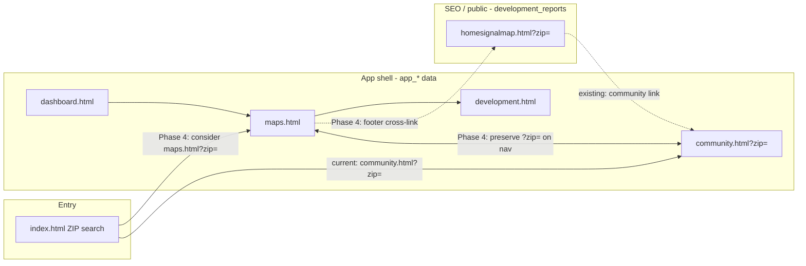

# Phase 3 — Navigation Analysis

> **Read-only deliverable.** No product code was changed in Phase 3. Implementation
> recommendations are scoped to **Phase 4** unless noted otherwise.

## Executive summary

HomeSignal currently exposes **two parallel map/development experiences** and **inconsistent
ZIP-context propagation** across the signed-in app shell. A homeowner can land on the correct
community page for their ZIP, click **Maps** in the sidebar, and immediately be shown a
different geography (the session default `78617` Del Valle prototype) with no URL or UI cue
that the context switched.

The shell navigation itself is structurally sound (one shared `partials/shell.html`, consistent
`data-nav` highlighting). The friction is not broken links — it is **semantic routing**: which
page owns "the map," which data layer it reads, and whether `?zip=` survives a full page reload.

---

## 1. Current homepage routing

**File:** `index.html`

| Entry | Route | Evidence |
|-------|-------|----------|
| Hero ZIP search (`homeFind`) | `community.html?zip=<zip>` when `HS.data.isCovered(z)` | `index.html` line 82 |
| Uncovered ZIP | Opens location modal + request flow | `index.html` lines 82–83 |
| Signed-in resident with home | `HS.landingFor()` → `dashboard.html` (via `lib/landing.js`) | `index.html` lines 86–90 |
| "Go to your dashboard" link | `dashboard.html` (no zip param) | `index.html` line 36 |
| "Find my community" CTA | `HS.openLoc()` modal (not a direct route) | `index.html` line 65 |

**Notes:**

- `index.html` does **not** load `hs-resolve.js`. Coverage resolution uses `HS.data.isCovered()`
  (the `app_*` data layer), not `HS.resolveCoverageUrl()`.
- Homepage preview card renders from `HS.data.changes(HS.state.zip, home)` — defaults to
  `CFG.DEFAULT_ZIP` (`78617`) when the visitor has no saved area.
- `PLAN.md` references routing homepage ZIP search to `maps.html?zip=` as a future map-first
  journey; **that is not implemented on `main`**.

---

## 2. Current navigation routing (shared shell)

**File:** `partials/shell.html` (injected by `shell.js`)

| Nav label | Static href | Runtime override |
|-----------|-------------|------------------|
| Today's Priorities | `today.html` | none |
| Dashboard | `dashboard.html` | none |
| Alerts | `alerts.html` | none |
| Development & Impact | `development.html` | none |
| **Maps** | `maps.html` | none |
| Properties | `properties.html` | none |
| Zip Code Activity | `community.html` | **`shell.js::paintTopbar()`** sets `href` to `community.html?zip=<state.zip>` |

**Boot ZIP resolution** (`shell.js` lines 16–19):

```javascript
zip: LS.get('myZip', null) || CFG.DEFAULT_ZIP
```

Precedence today: saved `myZip` (localStorage) → default `78617`. No `?zip=` parsing at boot.
No session-scoped view ZIP.

**Topbar location label** (`shell.js::paintTopbar`, lines 267–270): when no saved property and
no `myZip`, shows `Del Valle (Sample Zip Code)` — **Phase 2 fixes this to key off viewed ZIP
only** (approved, uncommitted).

---

## 3. Current Maps routing

**File:** `maps.html` (map-first layout, Sprint 7)

| Aspect | Behavior | Evidence |
|--------|----------|----------|
| URL params | **None read** — no `URLSearchParams` / `?zip=` handling | grep: zero matches in `maps.html` |
| Data source | `app_*` tables via `lib/data.js` + `lib/map.js` | `maps.html` boot uses `HS.data.projects/changes/meetings(state.zip)` |
| ZIP scope | `HS.state.zip` from shell boot | inherits `myZip \|\| DEFAULT_ZIP` |
| Layout | Map-first `.mapsfull` — pins, filters, slide-over panels, What's Changed | shipped PR #289/#290 |
| Deep links | `development.html?id=` from panel actions | `maps.html` lines 523–528 |

**Separate stack — SEO Development Tracker:**

| Aspect | Behavior |
|--------|----------|
| File | `homesignalmap.html` |
| Data | `development_reports` cache + `get-address-report` edge function |
| Indexed | Yes (sitemap, `/development/<zip>` via `404.html`) |
| Cross-link | Footer line links to `community.html?zip=` for alerts | `homesignalmap.html` line 2147 |
| App cross-link | **None** from `maps.html` back to tracker |

`lib/map.js` header (lines 1–3) documents the intentional split: app map backbone vs tracker.

---

## 4. Current Community routing

**File:** `community.html`

| Aspect | Behavior | Evidence |
|--------|----------|----------|
| `?zip=` parsing | **Yes** — `URLSearchParams(location.search).get('zip')` | line 22 |
| Sets viewed ZIP | `HS.state.zip = zip` after parse | line 23 |
| Data | `app_*` via `HS.data.*` | lines 62–65 |
| Coverage gate | `coverageStatus` + substance gate for indexability | lines 28–37 |
| Outbound to Maps | **None** in page content — only via shell nav | grep: no `maps.html` in `community.html` |
| Share URL | `community.html?zip=<zip>` | line 66 |

This is the **only** shell page that reads `?zip=` from the URL today.

---

## 5. Current Development routing

**File:** `development.html`

| Aspect | Behavior | Evidence |
|--------|----------|----------|
| `?zip=` parsing | **No** | uses `HS.state.zip` from shell boot |
| `?id=` parsing | **Yes** — project/facility detail | line 28 |
| "See it on the map" | `location.href='maps.html'` — **drops ZIP and project id** | line 181 |
| Back links | `development.html` (no zip param) | lines 163, 227 |

---

## 6. Additional routing observations

### Dashboard (`dashboard.html`)

- "Open full map →" / map click → `maps.html` (no `?zip=`) — lines 25, 120–121
- "Your communities" → `community.html` (no `?zip=`; relies on `state.zip`) — line 38
- Project chips → `development.html?id=` (no zip) — line 145

### How It Works (`how-it-works.html`)

- Development map link → `homesignalmap.html` (tracker, not app map) — line 32
- Alerts setup → `community.html` (no zip) — line 45

### `hs-resolve.js` (orphaned module)

- Implements `HS.resolveCoverageUrl`, `HS.communityForZip`, `HS.pageForCommunity`
- **Not loaded by any HTML page** (grep: only `PLAN.md` references it)
- `index.html` uses `HS.data.isCovered()` instead

### Analytics ZIP (`events.js`)

- Separate `localStorage` key `hs_zip` (not `myZip`)
- Reads `?zip=` from URL on first event, then remembers for session
- Does not feed back into `HS.state.zip`

---

## 7. Findings (severity-ordered)

| ID | Finding | Severity | User-visible symptom |
|----|---------|----------|-------------------|
| **NAV-01** | ZIP context lost on shell navigation | **P1** | `community.html?zip=84101` → click Maps → see Del Valle (`78617`) data |
| **NAV-02** | Dual-map architecture unexplained in app | **P1** | "Maps" (app) vs "development map" (tracker) confuse beta users |
| **NAV-03** | Development → map drops project context | **P2** | "See it on the map" opens generic map, not the selected pin |
| **NAV-04** | Dashboard community link omits `?zip=` | **P2** | Relies on `state.zip` which may be wrong after deep link |
| **NAV-05** | Homepage routes to community, not map-first | **P2** | Map-first beta journey starts one click later than intended |
| **NAV-06** | `hs-resolve.js` unused | **P3** | Dead code; coverage routing diverges between modules |

### NAV-01 reproduction (verified by code inspection)

1. Signed-out visitor with no `myZip` opens `community.html?zip=84101`
2. `community.html` sets `HS.state.zip = '84101'`; page renders Salt Lake content
3. Visitor clicks sidebar **Maps** → full navigation to `maps.html` (no query string)
4. `shell.js` boot re-initializes: `state.zip = LS.get('myZip') || '78617'`
5. `maps.html` loads Travis County Del Valle projects — wrong geography

---

## 8. Recommended primary beta user journey

**One sentence:** Homepage ZIP → **Maps** (app map, `app_*` data) as the primary "see what's
changing" surface; **Zip Code Activity** (`community.html?zip=`) as the alerts/follow hub;
**homesignalmap.html** stays the public SEO tracker (EPA facilities floor + cached permits) with
explicit cross-links only.



**Rationale:** The map-first `maps.html` layout is the founder-approved beta centerpiece (PR
#289). Community pages own subscriptions and government notices. The tracker serves SEO and
the national EPA floor — merging stacks would violate the anti-fabrication boundary between
`app_*` and `development_reports`.

---

## 9. Phase 4 recommendations (NOT implemented — await approval)

### 9.1 Minimum viable fix — NAV-01 (highest priority)

**Option A (recommended): session-scoped view ZIP**

| Step | Change | Files |
|------|--------|-------|
| 1 | Parse `?zip=` on shell page boot; validate 5-digit | `shell.js` |
| 2 | Persist to `sessionStorage.setItem('hs:viewZip', zip)` | `shell.js` |
| 3 | Boot order: `myZip \|\| viewZip \|\| DEFAULT_ZIP` | `shell.js` |
| 4 | Append `?zip=` to sidebar nav hrefs when viewZip active | `shell.js` / `partials/shell.html` |
| 5 | Re-paint topbar when zip changes | `shell.js` (Phase 2 setter pattern) |

**Constraint:** Do **not** change `maps.html` layout/CSS — query-param read only.

**Acceptance criteria:**

- [ ] `community.html?zip=84101` → Maps → still shows `84101` data
- [ ] Same for Development & Impact and Dashboard
- [ ] Saved `myZip` still wins over session viewZip
- [ ] All existing unit tests pass
- [ ] New `test/navigation-zip.test.mjs` covers propagation

### 9.2 Dual-map clarity — NAV-02

- On `maps.html`: footer/help link to `homesignalmap.html?zip={state.zip}` ("public development tracker")
- On `homesignalmap.html`: strengthen existing `community.html?zip=` link copy
- Nav label rename ("Project map" vs "Maps") deferred to Phase 5 copy pass

### 9.3 Deep links — NAV-03, NAV-04

- `development.html` "See it on the map" → `maps.html?zip={state.zip}&id={p.id}`
- Dashboard "Your communities" → `community.html?zip={state.zip}`
- `maps.html` boot: select pin when `id` param matches

### 9.4 Explicit do-not-do list

- Do **not** merge `homesignalmap.html` into `maps.html`
- Do **not** wire `hs-resolve.js` without a product decision on coverage routing
- Do **not** change map-first `maps.html` layout
- Do **not** redirect or delete indexed SEO pages (`/development/<zip>`, sitemap entries)
- Do **not** change database schemas

---

## 10. Preserved behavior (unchanged by Phase 3)

- All routing, navigation, and page behavior remains exactly as on `main` @ `35af00f`
- `maps.html` map-first layout untouched
- `homesignalmap.html` SEO tracker untouched
- `community.html?zip=` deep links continue to work
- Shell byte-identical across pages (`partials/shell.html`)

---

## 11. Evidence anchors (code)

| Claim | Source |
|-------|--------|
| Boot ZIP = `myZip \|\| DEFAULT_ZIP` | `shell.js:19` |
| Only community.html reads `?zip=` | `community.html:22-23`; no matches in `maps.html` |
| Maps nav href is bare `maps.html` | `partials/shell.html:15` |
| Comm nav gets runtime zip | `shell.js:286` |
| App vs tracker data split | `lib/map.js:1-3`, `lib/data.js:1-6` |
| `hs-resolve.js` not loaded | repo-wide grep: zero `<script src="hs-resolve.js">` |
| Development map link drops context | `development.html:181` |
| Homepage → community | `index.html:82` |
